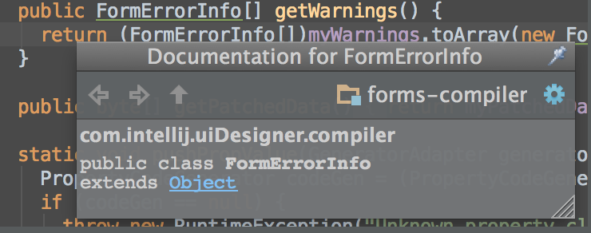
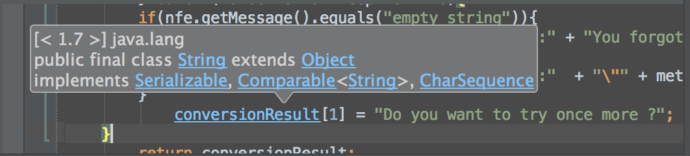
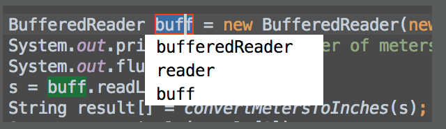
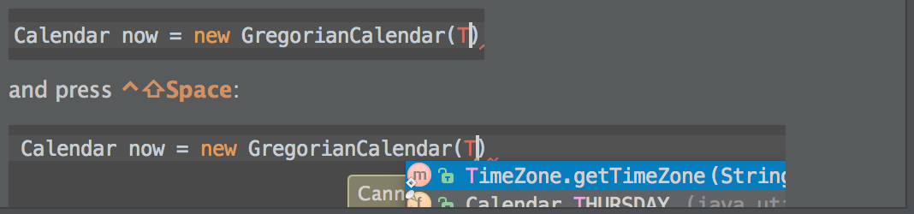
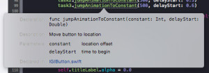

# eng-cards

**Table of Contents**

<!-- To update Table of Contents:
  npm install -g doctoc
  doctoc README.md -->

<!-- START doctoc generated TOC please keep comment here to allow auto update -->
<!-- DON'T EDIT THIS SECTION, INSTEAD RE-RUN doctoc TO UPDATE -->

- [Vim](#vim)
  - [Avoiding the Escape Key](#avoiding-the-escape-key)
  - [Instantly preview Markdown from Vim](#instantly-preview-markdown-from-vim)
  - [Use a Vim-style editor in XCode](#use-a-vim-style-editor-in-xcode)
  - [Manage Vim plugins with Vundle](#manage-vim-plugins-with-vundle)
  - [Toggle paste mode with \p](#toggle-paste-mode-with-%5Cp)
  - [Turn on line numbering](#turn-on-line-numbering)
- [Swift](#swift)
  - [Range Operators](#range-operators)
  - [What's New in Swift 2.0](#whats-new-in-swift-20)
- [Projects](#projects)
  - [Make a programmable mirror](#make-a-programmable-mirror)
  - [Command Line Pandora Client for Mac](#command-line-pandora-client-for-mac)
  - [Pi-rate Radio](#pi-rate-radio)
  - [Simple Soil Moisture Sensor](#simple-soil-moisture-sensor)
  - [Tweet-a-Pot: Twitter Enabled Coffee Pot](#tweet-a-pot-twitter-enabled-coffee-pot)
  - [3D Printed Retro Apple II Smartwatch](#3d-printed-retro-apple-ii-smartwatch)
- [cURL](#curl)
  - [Word Definitions from the Command Line](#word-definitions-from-the-command-line)
  - [Customize cURL's Output](#customize-curls-output)
  - [Fetch Multiple Files at a Time](#fetch-multiple-files-at-a-time)
  - [Download a File Based on Modified Date/Time](#download-a-file-based-on-modified-datetime)
  - [Pass HTTP Authentication in cURL](#pass-http-authentication-in-curl)
- [Open Source Projects](#open-source-projects)
  - [Neovim - Next Generation Vim Text Editor](#neovim---next-generation-vim-text-editor)
  - [CockroachDB - Google Scale for the Masses](#cockroachdb---google-scale-for-the-masses)
  - [Appium - Automation for Apps](#appium---automation-for-apps)
  - [Flight - An event-driven web framework, from Twitter](#flight---an-event-driven-web-framework-from-twitter)
  - [Genie - Hadoop job and resource management](#genie---hadoop-job-and-resource-management)
- [Android](#android)
  - [Retrieve System Logs from Your Device](#retrieve-system-logs-from-your-device)
  - [Android Studio Tips](#android-studio-tips)
  - [Android Studio Tips](#android-studio-tips-1)
  - [Android Studio Tips](#android-studio-tips-2)
  - [Android Studio Tips](#android-studio-tips-3)
  - [Android Studio Tips](#android-studio-tips-4)
- [Xcode](#xcode)
  - [Xcode Tips](#xcode-tips)
  - [Xcode Tips](#xcode-tips-1)
  - [Xcode Tips](#xcode-tips-2)
  - [Xcode Tips](#xcode-tips-3)
  - [Xcode Tips](#xcode-tips-4)

<!-- END doctoc generated TOC please keep comment here to allow auto update -->

## Vim

### Avoiding the Escape Key

Regularly reaching for the escape key in Vim can lead to pinky strain (ouch)!
Remap  to avoid the stretching  and keep your fingers on the home row.

    :imap jj

This allows you to press `jj` to exit from insert mode.  The `:imap` command is
used to create the mapping so that it only applies while in insert mode.  The
pair of characters "jj" occurs very rarely in English, so using it won't
interfere with normal typing

To type "jj" without triggering escape, just wait a couple seconds between each
character.

[VimTips Wiki](http://vim.wikia.com/wiki/Avoid_the_escape_key)

### Instantly preview Markdown from Vim

Want to instantly preview finnicky markdown files, but don't want to leave your
favorite editor, or have to do it in some crappy browser textarea?
**vim-instant-markdown** is your friend! When you open a markdown file in vim, a
browser window will open which shows the compiled markdown in real-time, and
closes once you close the file in vim.

As a bonus,
[github-flavored-markdown](http://github.github.com/github-flavored-markdown/)
is supported, and styles used while previewing are the same as those github
uses!

[vim-instant-markdown on GitHub](https://github.com/suan/vim-instant-markdown)

### Use a Vim-style editor in XCode

Sometimes IDEs are a necessary evil.  For OO languages and large APIs
or codebases, they can be especially useful.  And XCode has some great features
for building stunning UIs.  But you don't have to give up your the speed and
efficiency of your favorite editor, Vim!

Install the **XVim plugin** and get a rich set of vim features and keybindings
right inside XCode's editor.

[XVim on GitHub](https://github.com/XVimProject/XVim)

### Manage Vim plugins with Vundle

Automatically manage all of your vim plugins and scripts with Vundle, a plugin
manager for Vim.  Gone are the days of manually downloading, extracting and
installing files into `~/.vim`.  Vundle makes installing, updating and
configuring all your plugins simple.  Just refer to each plugin's GitHub repo in
your `~/.vimrc`

[Vundle on GitHub](https://github.com/VundleVim/Vundle.vim)

### Toggle paste mode with \p

Auto-indenting, key mappings and other settings can mess up the formatting and
indentation when pasting code into Vim.  To avoid this problem, Vim provides a
paste mode that turns these features off in insert mode.  To enable or disable
paste mode:

    :set paste
    :set nopaste

Binding a fast key sequence to `pastetoggle` will make it quick and easy to turn
`paste` mode on and off.  For example, put the following in your `.vimrc`:

    set pastetoggle=<Leader>p

`<Leader>` defaults to the backslash `\` character if you don't have a custom
[mapleader](http://usevim.com/2012/07/20/vim101-leader/) set.
To use this, enter insert mode, then type the `\` and `p` keys sequentially.
You should see:

    -- INSERT (paste) --

and be able to paste without broken formatting.  Type `\` `p` again to turn off
paste mode.

[VimTips Wiki](http://vim.wikia.com/wiki/Toggle_auto-indenting_for_code_paste)

### Turn on line numbering

Line numbers can be very important to using vim effectively.  Most normal mode
commands take optional line number or repeat count.  For example, `8gg` will jump
to line 8.  To turn on and off line numbers use:

    :set number
    :set nonumber

It can also be helpful to set a different color scheme for the line number
columns to clearly distinguish them from the buffer text.

    :highlight LineNr ctermfg=black ctermbg=gray

Some commands work better with relative line numbers.  Typing `3j` will move
down by 3 lines from the current position, or `4dd` will delete 4 lines.  For
these, it can be helpful to set relative line numbering:

    :set relativenumber

[VimTips Wiki](http://vim.wikia.com/wiki/Display_line_numbers)

## Swift

### Range Operators

Use the range operators to simplify for loop syntax.  You can keep an index in a
loop—either by using `..<` to make a range of indexes or by writing an explicit
initialization, condition, and increment. These two loops do the same thing:

    var firstForLoop = 0
    for i in 0..<4 {
      firstForLoop += i
    }
    print(firstForLoop)

    var secondForLoop = 0
    for var i = 0; i < 4; ++i {
      secondForLoop += i
    }
    print(secondForLoop)

Use `..<` to make a range that omits its upper value, and use `...` to make
a range that includes both values.

[Swift Language Guide](https://developer.apple.com/library/prerelease/ios/documentation/Swift/Conceptual/Swift_Programming_Language/BasicOperators.html#//apple_ref/doc/uid/TP40014097-CH6-ID60)

### What's New in Swift 2.0

Swift 2.0 takes the advanced object-oriented Swift programming language and extends it: 

**Error Handling.** Throw, catch, manage, and handle errors in Swift. Interoperate seamlessly with NSError. 

**Availability.** Adopt new APIs while still deploying back to older OS versions, with compile-time errors to catch situations when you've used API that isn't available on the deployment target.

**Protocol extensions.** Add methods and properties to any class that confroms to a protocol. Re-use more of your code. 

**Testability.** Write tests of Swift 2.0 frameworks and apps with access to all your public and internal routines. 

**Swift 1.2 to 2.0 Migrator.** Efficiently upgrade your existing Swift source code to take advantage of Swift 2.0. 

In addition to these new features, the big news is that Apple will be making Swift open source. 

Read all about Swift 2.0 on [Apple's Swift blog](https://developer.apple.com/swift/blog/?id=29). 

## Projects

### Make a programmable mirror

Mount an Android device on the back of a two-way mirror to display date,
time, weather, birthday reminders, chore reminders, stock prices, XKCD, etc.

[HomeMirror on GitHub](https://github.com/HannahMitt/HomeMirror)

###Command Line Pandora Client for Mac

Skip the ads without upgrading and more importantly free yourself from the unnecessary bloat of a GUI. That's right a simple but powerful command line Pandora Client in less than two minutes. 

Step one: Install Homebrew (you'll thank us later)

    curl -L http://github.com/mxcl/homebrew/tarball/master | tar xz --strip 1 -C /usr/local

Step two: Install Pianobar

    brew install pianobar

Step three: Run Pianobar

    pianobar

###Pi-rate Radio 

A simple, but effective hack from Make shows how you can turn your Raspberry Pi into a mobile FM transmitter to share your tunes with those around you. 

Details available on [Makezine.com](http://makezine.com/2014/03/14/yar-matey-streaming-raspberry-pirate-radio-is-as-easy-as-pipe/). 

 

###Simple Soil Moisture Sensor

This cool Ardunio based project will show you how to create a soil moisture sensor that will light up a LED at a certain moisture level. 

Example source code: 
    
    void loop() {
      int moisture = analogRead(VAL_PROBE); 
      Serial.println(moisture); 
        if(moisture > MOISTURE_LEVEL) {
          LedState(HIGH);
        }
    }

###Tweet-a-Pot: Twitter Enabled Coffee Pot 

This amazing Ardunio based project will show you how to create a Twitter enabled cofee pot. That's right with just a bit of code and some hardware, you can kickoff your morning brew with a simple tweet! 

###3D Printed Retro Apple II Smartwatch 

Forget the Apple Watch, build yourself this sweeet retro Apple II smartwatch and hit the streets with a sensational tribute to the 1980s. 

Download the complete project instructions on [instructables.com](http://www.instructables.com/id/Apple-II-Watch/). 

## cURL

###Word Definitions from the Command Line

You can use cURL to get the definition for a word with the help of the DICT protocol. Just pass a Dictionary Server URL to it and the word you want the definition for. 

    $curl dict://dict.org/d:genesis

The above command will list the definition for genesis as follows: 

    "genesis" gcide "The Collaborative International Dictionary of English v.0.48" Genesis \Gen"e*sis\, n. [L., from Gr. ge'nesis, fr. the root of gi'gnesqai to geget, be born; akin to L. genus birth, race. See {Gender}. ]

    [1913 Webster]

    1. the act of producing, or giving birth or origin to anything. 

###Customize cURL's Output

Normally, when you use cURL you use the command

    $curl -IL "url"

The above command would send a HEAD request (-I), follow all redirects (-L), and display some useful information: 

    HTTP/1.1 200 OK
    Date: Mon, 14 Sep 2015 08:57:17 GMT
    Expires: -1
    Cache-Control: private, max-age=0
    Content-Type: text/html; charset=ISO-8859-1
    P3P: CP="This is not a P3P policy! See http://www.google.com/support/accounts/bin/answer.py?hl=en&answer=151657 for more info."
    Server: gws
    X-XSS-Protection: 1; mode=block
    X-Frame-Options: SAMEORIGIN
    Set-Cookie: PREF=ID=1111111111111111:FF=0:TM=1442221037:LM=1442221037:V=1:S=0D6fmKXKZeC7wtqi; expires=Thu, 31-Dec-2015 16:02:17 GMT; path=/; domain=.google.com
    Set-Cookie: NID=71=XvDbVOyhmtTu7Un1KojuMxqXI6moknK_u-OIBlVZ8sbtsYZ8HotHRryJoPAyOP4Wo6fFLZgHIfyL8isO4wIrIM_rgmTExQ_dHIwJrpsfyaJTs-XYxPclnIAammkjtP6K; expires=Tue, 15-Mar-2016 08:57:17 GMT; path=/; domain=.google.com; HttpOnly
    Transfer-Encoding: chunked
    Accept-Ranges: none
    Vary: Accept-Encoding

But what if you're only interested in a subset of the standard cURL output? cURL provides special variables for customizing output. The following command only prints the http status code of the request and redirects curl's HTML output to /dev/null. 

    $curl -sL -w "%{http_code} % {url_effective} \\n" "URL" -o /dev/null

The above command results in the following output: 

    200 HTTP://www.google.com/

Here are the other special variables available in case you want to customize the output some more. 

    url_effective, http_code, http_connect, time_total, time_namelookup, time_connect, time_pretransfer, time_redirect, time_starttransfer, size_download, size_upload, size_header, size_request, speed_download, speed_upload, content_type, num_connects, num_redirects, ftp_entry_path

###Fetch Multiple Files at a Time 

You can download multiple files in a single shot by specifying the URLs on the command line: 

    $curl -O URL1 -O URL2

The below command will download both index.html and gettext.html and save it in the same name under the current directory. 

    $ curl -O http://www.gnu.org/software/gettext/manual/html_node/index.html -O http://www.gnu.org/software/gettext/manual/gettext.html

Please note that when we download multiple files from the same server as shown above, cURL will try to re-use the connection. 

###Download a File Based on Modified Date/Time

You can get the files that are modified after a particular time using -z option in cURL. This will work for both FTP & HTTP: 

    $curl -z 21-Dec-14 http://www.example.com/yy.html

The above command will download the yy.html only if it is modified later than the given date and time. 

    $curl -z -21-Dec-14 http://www.example.com/yy.html 

The above command will download the yy.html, if it is modified before the given date and time. 

Refer to 'man curl_getdate' for the various syntax supported for the date expression. 

###Pass HTTP Authentication in cURL 

Sometimes, websites will require a username and password to view the content of a page. With the help of -u option, we can pass those credentials from cURL to the web server as shown below: 

    $curl -u username:password URL 

Please note that by default curl uses Basic HTTP Authentication. You can specify other authentication methods using -ntlm | -digest. 

##Open Source Projects

###Neovim - Next Generation Vim Text Editor

The Vim text editor has been loved by a generation of users. We're aggressively refactoring Vim to ensure it stays relevant in the future. 

**More Powerful Plugins**

Neovim is rebuilding the plugin architecture from the ground up to provide a system that allows for extensions in any language and will be backwards compatible with your old plugins. 

**Better GUI Architecture**

Neovim will focus on providing a headless text editing environment. This will allow any GUI to be written that ties into the native GUI of whatever os it is running on. 

**First Class Support for Embedding**

Any program will be able to include NeoVim commands right in the application. 

[neovim on GitHub](https://github.com/neovim/neovim)

###CockroachDB - Google Scale for the Masses

Finally, a db as indestructible as a cockroach. While at Google we fell in love with Spanner, Google's solution to juggling data between millions of database servers, so we decided to create an open source project to bring that scalability to the masses. 

**Automated Scaling / Repair**

CockroachDB will allow you to add resources to scale horizontally, with zero hassle and no downtime. It will self-organize, self-heal, and automatically rebalance.

**Strong Consistency**

CockroachDB will implement consistent replication via majority consensus between replicas. 

**Distributed Transactions**

CockroachDB will implement efficient, full-serializable distributed transations. 

[CockroachDB on GitHub](https://github.com/cockroachdb/cockroach)

###Appium - Automation for Apps

Appium is an open source test automation framework for use with native and hybrid mobile apps. It drives iOS and Android apps via the WebDriver JSON wire protocol. 

Initially started as a tool for SauceLabs to help customers build a scalable, automated test environment, Appium has taken on a life of its own with a rapidly expanding, diverse developer community. 

Appium wants you! We need your help - get involved today! Let's make it rockium together!! 

[Appium on GitHub](https://github.com/appium/appium)

###Flight - An event-driven web framework, from Twitter

Flight is distinct from existing frameworks in that it doesn't prescribe or provide any particular approach to rendering or providing data to a web application. While some web frameworks encourage developers to arrange their code around a prescribed model layer, Flight is organized around the existing DOM model with functionality mapped directly to DOM nodes. 

 

Contribute to a Twitter project! Checkout our [GitHub issues](https://github.com/flightjs/flight/issues) to see what needs doing To get started, you could try a [helpwanted ticket](https://github.com/flightjs/flight/labels/helpwanted)! 

###Genie - Hadoop job and resource management 

Genie abstracts away the physical details of various (potentially transient) Hadoop resources in the cloud, and provides a REST-ful execution service to submit and monitor Hadoop, Hive and Pig jobs wiothut having to install any Hadoop clients. 

Join the Netflix open source team today and maybe we'll grant you three wishes! 
[Genie on GitHub](https://github.com/Netflix/genie)

##Android

###Retrieve System Logs from Your Device

When your application crashes and the device isn't connected to a computer you still need the system logs to uncover what went wrong and luckily there's a really powerful and free tool for that called Android Debug Bridge (adb). 

In order to use adb with a device connected over USB, you must enable USB debugging in the device system settings under Developer options. 

Open your terminal and navigate the Android skd sub directory platform-tools type in the following command to dump the log to the screen. 

    $adb logcat -d 

The command above will produce the following output: 

###Android Studio Tips

To quickly see the documentation for a class or method at caret, press F1 (View | Quick Documentation). 

###Android Studio Tips

To navigate to the declarion of a class, method or variable used somewhere in the code, position the caret at the usage and press command-B (Navigate | Declaration). You can also click the mouse on usages with the Ctrl key pressed to jump to declartions. 

###Android Studio Tips

You can easily rename your classes, methods and variables with automatic correction of all places where they are used. 

To try it, place the caret at the symbol you want to rename, and press F6(Refactor | Rename). Type the new name in the popup window that appears, or select one of the suggested names, and press Enter. 

###Android Studio Tips

The SmartType code completion greatly helps to find methods and variables that are suitable in the current context, by analyzing the expected type of the whole expression. So doing, Android Studio pinpoints the top five most suitable results and highlights them on the green background. For example, type

###Android Studio Tips

Did you know that you can close tabs in the editor and the tool windows of Android Studio without actually using the context menu commands? It is enough to point with your mouse cursor to a tab to be closed, and click the middle mouse button, or just use the Shift+click combination. 

##Xcode 

###Xcode Tips 

**Xcode Behaviors**

Behaviors are an amazing way to automatically have Xcode perform actions based on your actions. Imagine if you are running your project and hit a breakpoint or error. By default Xcode will automatically open the debugger windows, navigate to the code in error, and completely throw your editor out of sync. Let's explore creating a new behavior to stop that from happening...

[xmcgraw.com](http://www.xmcgraw.com/13-xcode-tips-that-will-help-you-conquer-xcode/)

###Xcode Tips

**Update App Display Name**

One common issue folks run into is that they create a project only to find out that their display name isn't what they wanted. I'll often see people renaming and refactoring their entire project name to show the proper display name. You'll be happy to know that there is a key you can add to your project info plist to fix this problem. Add a new key Bundle display name. 

###Xcode Tips

**Documentation Generation**

Instead of manually typing out comment blocks download and install the plugin [VVDocumenter-Xcode](https://github.com/onevcat/VVDocumenter-Xcode). This will let you quickly generate comments by just typing three slashes (///). 

The side benefit from doing this is that Xcode will use these comments to show preview documenttion of the method. By pressing Option + Click on the method you'll see a documentation quick look. 

###Xcode Tips

**Enhanced Debugging with Chisel**

Facebook built a collection of LLDB commands to help make debugging a little more enjoyable. If you don't have these take the time to jump to [Github](https://github.com/facebook/chisel) to install them. To give you a sense of what this provides here is a list of a few of my favorite commands. 

**views**: print the recursive view description for the key window

**visualize**: open a UIImage, CGImageRef, UIView, or CALayer in Preview.app on your Mac

**show/hide**: show or hide the given view or layer

**border/unborder**: show or hide a border to a view or layer to visualize where it is

There is a lot to Chisel so jump into lldb and type help to review a list of user-defined commands. 

###Xcode Tips 

**6 Key Commands Worth Memorizing & Setting**

Some of these commands are not set by default, but I encourage you to open Preferences > Key Bindings to modify them as needed. 

**Command + /**: comment/uncomment code

**Command + [or]**: index/unindent code

**Control + s**: select word

**Option + Command + e**: edit the selected word based on the current scope

**Option +Left/Right Arrow**: navigate words

**esc**: bring up possible auto-completion choices

There are many, many more key commands. Find the commands that fit your style and roll with it. 
